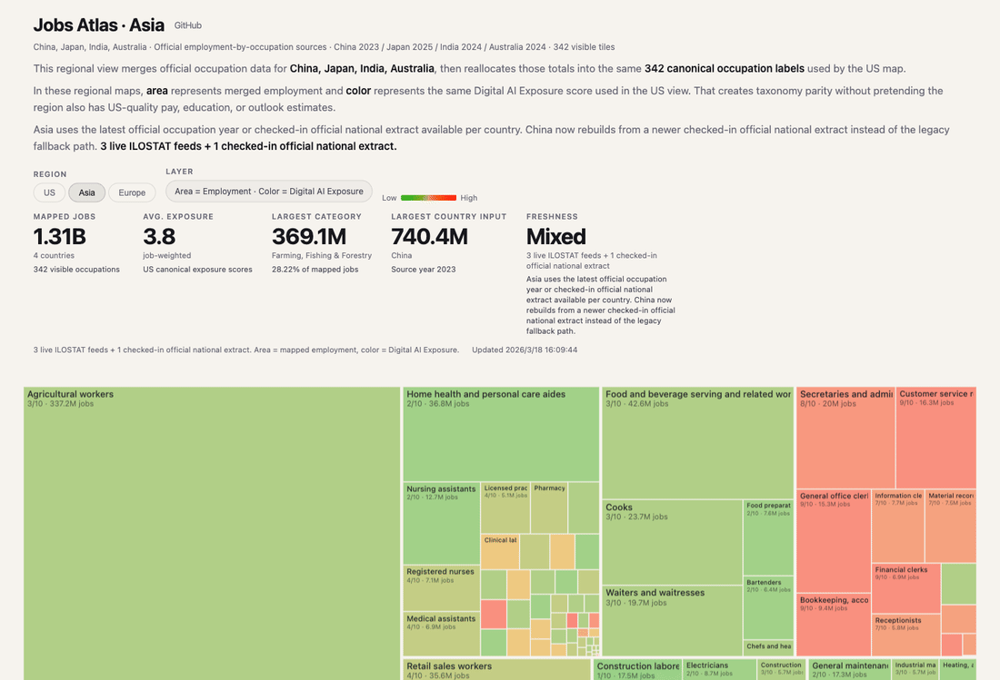

# Jobs Atlas

A living map of work across the US, Asia, and Europe.



Live site: [jobs-psi-ochre.vercel.app](https://jobs-psi-ochre.vercel.app)

## What this is

Jobs Atlas is a single-page treemap that tracks how employment is distributed across occupations, then colors those occupations by one of several layers:

- `US`: BLS outlook, median pay, education, and Digital AI Exposure
- `Asia`: merged regional employment plus Digital AI Exposure
- `Europe`: merged regional employment plus Digital AI Exposure

The frontend is static. The repo contains the scrapers, transforms, scoring pipeline, regional crosswalks, and generated payload that power the live Vercel deployment.

## Data sources

| View | Geography | Source | Native classification | Year logic | Refresh mode |
| --- | --- | --- | --- | --- | --- |
| `US` | United States | [Bureau of Labor Statistics Occupational Outlook Handbook](https://www.bls.gov/ooh/) | BLS OOH occupations | Single `2024` release | Rebuilt from checked-in BLS artifacts |
| `Asia` | China | [National Bureau of Statistics of China](https://www.stats.gov.cn/) via [China Labour Statistical Yearbook 2024](https://www.stats.gov.cn/hd/lyzx/zxgk/202405/t20240524_1953603.html) plus the checked-in extract in [regional_sources/china_official_occupation_mix_2023.csv](/Users/bozliu/Documents/Commecial%20Value%20Projects/jobs/regional_sources/china_official_occupation_mix_2023.csv) | China national seven-group occupation mix, then mapped into the 342 canonical Jobs Atlas occupations | `2023 employment total · 2018 occupation mix` | Manual refresh when a newer official table is extracted into the repo |
| `Asia` | Japan | [ILOSTAT employment by occupation](https://ilostat.ilo.org/data/) | ISCO-08 major groups | Latest official year available for Japan | Daily GitHub Action refresh |
| `Asia` | India | [ILOSTAT employment by occupation](https://ilostat.ilo.org/data/) | ISCO-08 major groups | Latest official year available for India | Daily GitHub Action refresh |
| `Asia` | Australia | [ILOSTAT employment by occupation](https://ilostat.ilo.org/data/) | ISCO-08 major groups | Latest official year available for Australia | Daily GitHub Action refresh |
| `Europe` | Germany, United Kingdom, France, Italy, Spain | [ILOSTAT employment by occupation](https://ilostat.ilo.org/data/) | ISCO-08 major groups | Latest shared official year across all selected countries | Daily GitHub Action refresh |

## Why China is different

China is the only selected country in Asia that does not currently flow through the same live ILOSTAT path as Japan, India, and Australia.

The repo now uses a checked-in official national extract for China, anchored to the latest official employment total used in the labour yearbook series plus a versioned nationwide occupation-mix extract that can be rebuilt reproducibly inside this repo. That means:

- the visible China year is newer than the old ILOSTAT fallback
- the site can rebuild deterministically in CI
- China is still not a live API source like Japan, India, or Australia

If a newer official nationwide occupation table becomes available in a machine-readable or extractable form, replacing the checked-in China file is the intended upgrade path.

## Update mechanism

Daily refresh runs in [daily-refresh.yml](/Users/bozliu/Documents/Commecial%20Value%20Projects/jobs/.github/workflows/daily-refresh.yml).

- US scoring reruns only when the scoring inputs change.
- API-backed regional countries refresh every day from ILOSTAT.
- China is validated every day, but it only changes when the checked-in official extract is replaced.
- Generated outputs are committed only when tracked artifacts actually change.
- Vercel deploys from the repo’s production branch, so the public URL stays fixed.

## Method

- US occupations come directly from BLS and stay in their native 342-slug taxonomy.
- Regional data starts from official country-level occupation inputs.
- Those country totals are projected into the same 342 canonical occupation slugs as the US view using deterministic employment-weighted crosswalks.
- Regional views guarantee taxonomy parity with the US map, but not US-grade parity for pay, education, or outlook.
- Digital AI Exposure is an LLM-scored overlay, not a prediction that a job disappears.

## Local development

```bash
uv sync
uv run python fetch_regional_data.py
uv run python validate_regional_data.py
uv run python build_site_data.py
uv run python make_prompt.py
cd site && python -m http.server 8000
```

## Important files

- [site/index.html](/Users/bozliu/Documents/Commecial%20Value%20Projects/jobs/site/index.html): static frontend
- [build_site_data.py](/Users/bozliu/Documents/Commecial%20Value%20Projects/jobs/build_site_data.py): builds the multi-region payload
- [fetch_regional_data.py](/Users/bozliu/Documents/Commecial%20Value%20Projects/jobs/fetch_regional_data.py): refreshes regional source artifacts
- [regional_source_catalog.json](/Users/bozliu/Documents/Commecial%20Value%20Projects/jobs/regional_source_catalog.json): source metadata and refresh policy
